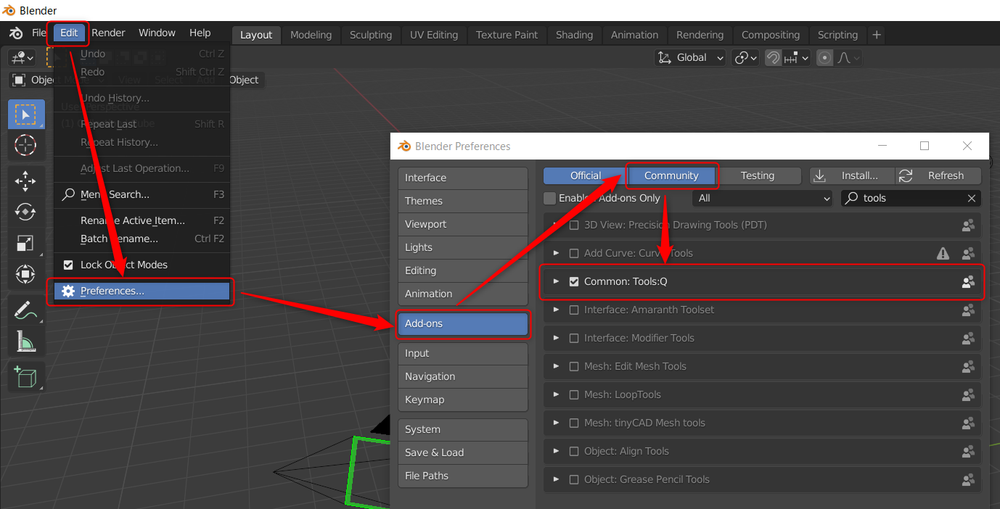

# Tools:Q Common

[日本語](README.md)

This is a Blender addons for creating common developed by Project Studio Q inc.

## How to Install

## Testing Environment
- Windows 10 Pro
- Blender 2.93.3, Blender 2.93.5

## Addons
- [Compositing Loader](https://github.com/Project-StudioQ/compositing_io)

## License

This blender addon is under GNU Public License v2.
